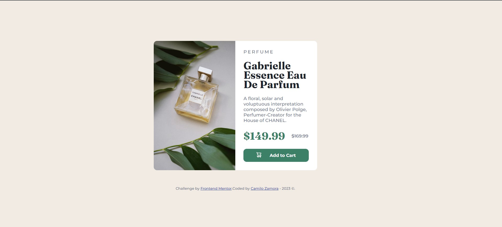

# Frontend Mentor - Product preview card component solution

This is a solution to the [Product preview card component challenge on Frontend Mentor](https://www.frontendmentor.io/challenges/product-preview-card-component-GO7UmttRfa). Frontend Mentor challenges help you improve your coding skills by building realistic projects. 

## Table of contents

- [Overview](#overview)
  - [The challenge](#the-challenge)
  - [Screenshot](#screenshot)
  - [Links](#links)
- [My process](#my-process)
  - [Built with](#built-with)
  - [What I learned](#what-i-learned)
  - [Continued development](#continued-development)
- [Author](#author)
- [Acknowledgments](#acknowledgments)

**Note: Delete this note and update the table of contents based on what sections you keep.**

## Overview

### The challenge

Users should be able to:

- View the optimal layout depending on their device's screen size
- See hover and focus states for interactive elements

### Screenshot

### Links

- Solution URL: (https://github.com/CamiloZamora/Product-preview-card)
- Live Site URL: (https://camilozamora.github.io/Product-preview-card/)

## My process

### Built with

- Semantic HTML5 markup
- CSS
- Flexbox
- CSS Grid

### What I learned

Practiced a CSS and HTML syntax, as well as how to improve HTML structure. 

### Continued development

Getting comfortable working with HTML and CSS as well as some JS, but have to practice more. Next challenge I´d like to try with a junior project and also try to use a framework.

## Author

- Website - Camilo Zamora
- Frontend Mentor - [@CamiloZamora](https://www.frontendmentor.io/profile/CamiloZamora)
- Github - [@CamiloZamora](https://github.com/CamiloZamora)

## Acknowledgments

I´d really apreciate any tip or improvement I can do to the code. Also, what framework can I start working with?